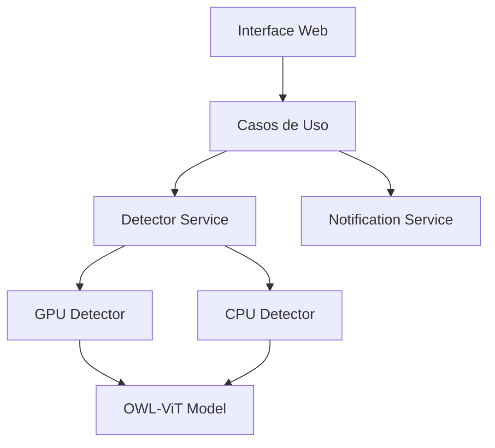

# Arquitetura do Sistema

## Visão Geral

O sistema de detecção de riscos em vídeo é construído seguindo os princípios da Clean Architecture, garantindo separação de responsabilidades e facilitando a manutenção e evolução do código.

## Camadas da Arquitetura

### 1. Domain (Núcleo)
- Contém as regras de negócio e entidades fundamentais
- Independente de frameworks e bibliotecas externas
- Localização: `src/domain/`

#### Componentes Principais:
- `detectors/`: Implementações dos detectores (GPU/CPU)
- `entities/`: Objetos de domínio
- `factories/`: Fábricas para criação de objetos
- `interfaces/`: Contratos e interfaces

### 2. Application
- Implementa os casos de uso da aplicação
- Orquestra o fluxo de dados entre as camadas
- Localização: `src/application/`

#### Casos de Uso:
- `process_video`: Processamento e análise de vídeos
- Notificações de detecções
- Gerenciamento de cache

### 3. Infrastructure
- Implementações concretas de interfaces
- Integrações com serviços externos
- Localização: `src/infrastructure/`

#### Serviços:
- `WeaponDetectorService`: Serviço principal de detecção
- `NotificationService`: Serviço de notificações
- Gerenciamento de GPU/CPU

### 4. Presentation
- Interface com usuário via Gradio
- Localização: `src/presentation/`

#### Componentes:
- Interface web responsiva
- Configurações de processamento
- Visualização de resultados

## Fluxo de Dados

1. Upload do vídeo via interface Gradio
2. Processamento pelo caso de uso
3. Detecção de objetos usando GPU/CPU
4. Notificações (se configuradas)
5. Retorno dos resultados

## Otimizações

### GPU
- Detecção automática de hardware
- Configurações específicas para T4 e Zero-GPU
- Gerenciamento de memória otimizado

### CPU
- Fallback automático
- Otimizações para processamento em CPU
- Cache de resultados

## Diagrama de Componentes

## Considerações de Design

1. **Inversão de Dependência**
   - Interfaces abstratas no domínio
   - Implementações concretas na infraestrutura

2. **Single Responsibility**
   - Cada componente com responsabilidade única
   - Separação clara de concerns

3. **Open/Closed**
   - Extensível para novos detectores
   - Fácil adição de novos serviços 