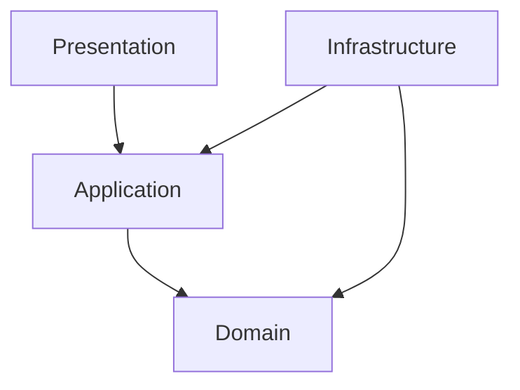
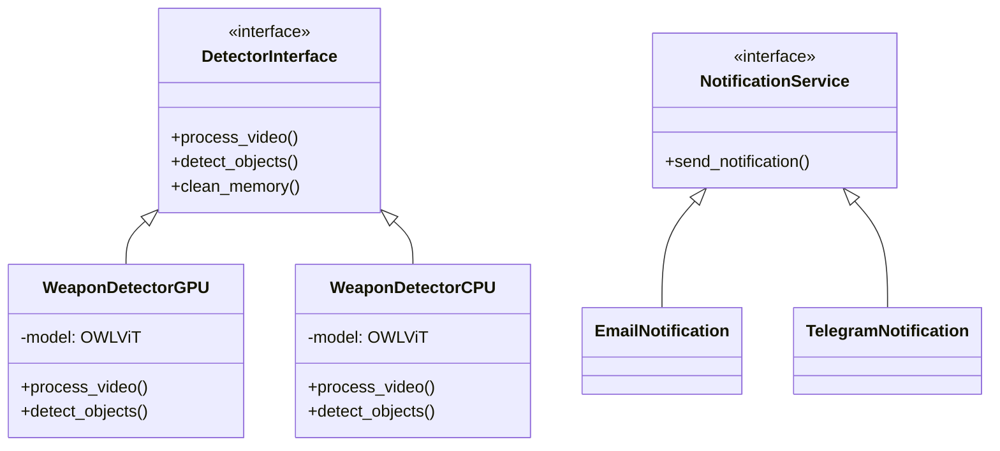
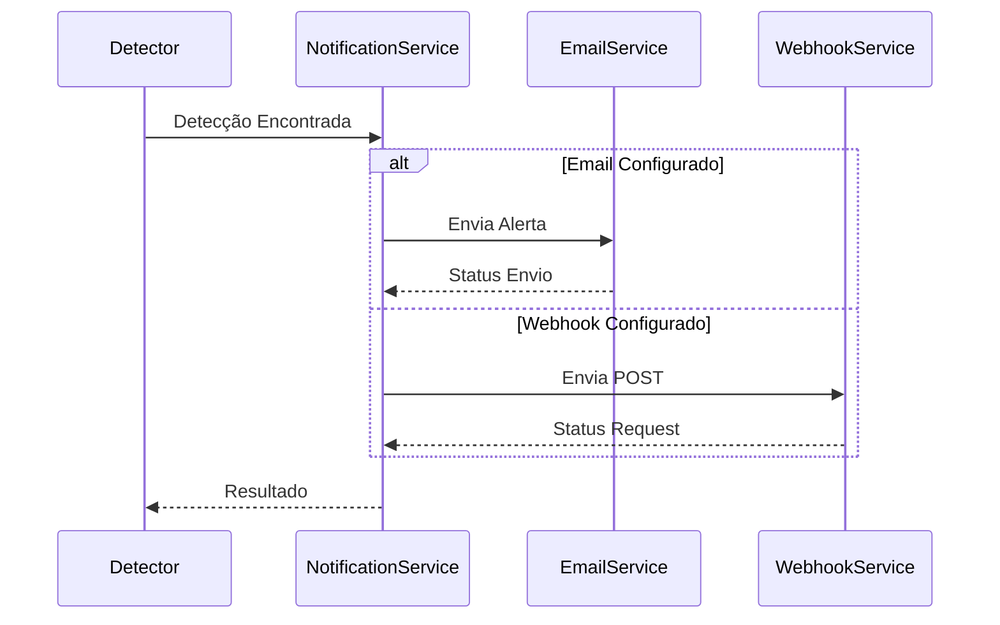
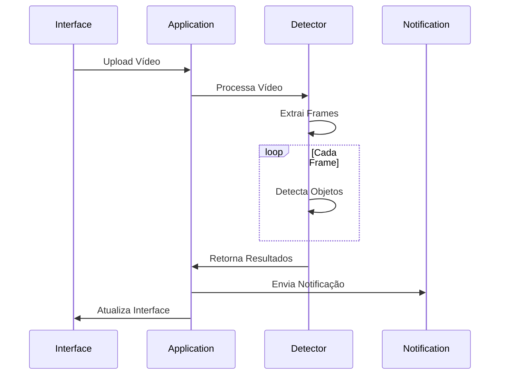
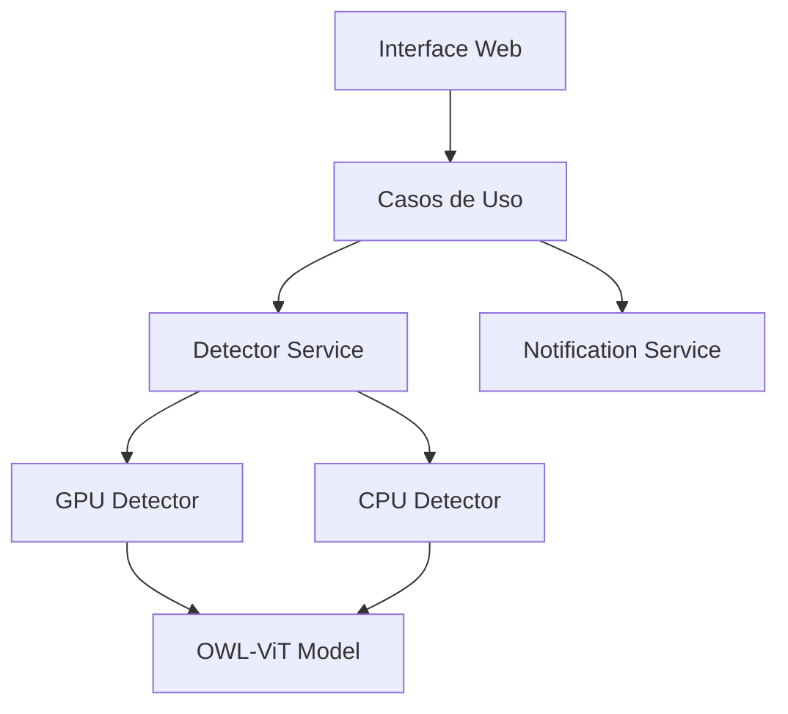

# Arquitetura do Sistema

## Visão Geral

O sistema de detecção de riscos em vídeo é construído seguindo os princípios da Clean Architecture, garantindo separação de responsabilidades e facilitando a manutenção e evolução do código.

## Modelo de IA: OWL-ViT

O OWL-ViT (Vision Transformer for Open-World Localization) é um modelo de visão computacional avançado que combina:

- Transformers para processamento de imagens
- Zero-shot learning para detecção de objetos
- Queries em linguagem natural para especificar alvos

### Considerações Técnicas

#### Versões do Modelo

1. **OWL-ViT Base (Atual)**

   ```python
   model_name = "google/owlv2-base-patch16"
   ```

   - Compatível com GPU T4
   - Otimizado para inference
   - Suporte a half precision

2. **OWL-ViT Ensemble (Descontinuado)**

   ```python
   model_name = "google/owlv2-base-patch16-ensemble"
   ```

   - Problemas de compatibilidade GPU
   - Requer branch dev do Transformers
   - Maior precisão, mas instável

#### Requisitos Específicos

```python
# Configurações necessárias para GPU
torch.backends.cuda.matmul.allow_tf32 = True
torch.backends.cudnn.benchmark = True
model = model.half()  # Usar FP16

# Branch específico do Transformers
# pip install git+https://github.com/huggingface/transformers.git
```

### Como Funciona

1. **Processamento de Imagem**
   - Divide a imagem em patches
   - Processa usando arquitetura Transformer
   - Gera representações visuais ricas

2. **Sistema de Queries**
   - Aceita descrições em texto natural
   - Exemplos de queries efetivas:

     ```python
     queries = [
         "uma arma de fogo",
         "uma pistola",
         "um rifle",
         "uma faca",
         "um objeto pontiagudo perigoso"
     ]
     ```

3. **Detecção Zero-shot**
   - Não requer treinamento específico
   - Adapta-se a novos objetos
   - Alta precisão em tempo real

## Clean Architecture

### Camadas



1. **Domain (Núcleo)**
   - Regras de negócio
   - Entidades fundamentais
   - Interfaces abstratas

2. **Application**
   - Casos de uso
   - Orquestração
   - Lógica de aplicação

3. **Infrastructure**
   - Implementações concretas
   - Integrações externas
   - Adaptadores

4. **Presentation**
   - Interface Gradio
   - APIs REST
   - Webhooks

### Diagrama de Classes



## Extensibilidade

### 1. Novos Modelos de IA

```python
class NewDetector(DetectorInterface):
    """Implementação de novo detector."""
    def process_video(self):
        # Implementação específica
        pass
```

### 2. Suporte a Hardware

- Abstração de hardware via interfaces
- Fácil adição de novos backends:
  - TPU
  - Neural Engine
  - Outros aceleradores

### 3. Sistema de Notificações

```python
class NotificationService {
    """Serviço de notificação abstrato."""
    def send_notification(self):
        # Implementação específica
        pass
}

class EmailNotification(NotificationService):
    """Serviço de notificação por e-mail."""
    def send_notification(self, detection_data: dict, target: str):
        # Envia e-mail com detalhes da detecção
        pass

class WebhookNotification(NotificationService):
    """Serviço de notificação via webhook."""
    def send_notification(self, detection_data: dict, webhook_url: str):
        # Envia POST request para o webhook configurado
        pass
```

#### Tipos de Notificação Implementados

1. **E-mail**
   - Envio de alertas por e-mail
   - Suporte a templates HTML
   - Detalhes das detecções incluídos
   - Configurável via variáveis de ambiente

2. **Webhook**
   - Integração com sistemas externos
   - Payload JSON customizável
   - Suporte a autenticação
   - Headers configuráveis
   - Retry com backoff exponencial

#### Fluxo de Notificações



## Fluxo de Processamento



## Benefícios da Arquitetura

1. **Desacoplamento**
   - Mudanças em uma camada não afetam outras
   - Facilita testes unitários
   - Permite evolução independente

2. **Manutenibilidade**
   - Código organizado e previsível
   - Responsabilidades bem definidas
   - Fácil localização de problemas

3. **Escalabilidade**
   - Novos detectores sem mudanças no core
   - Múltiplos backends de processamento
   - Sistemas de notificação plugáveis

## Camadas da Arquitetura

### 1. Domain (Núcleo)

- Contém as regras de negócio e entidades fundamentais
- Independente de frameworks e bibliotecas externas
- Localização: `src/domain/`

#### Componentes Principais

- `detectors/`: Implementações dos detectores (GPU/CPU)
- `entities/`: Objetos de domínio
- `factories/`: Fábricas para criação de objetos
- `interfaces/`: Contratos e interfaces

### 2. Application

- Implementa os casos de uso da aplicação
- Orquestra o fluxo de dados entre as camadas
- Localização: `src/application/`

#### Casos de Uso

- `process_video`: Processamento e análise de vídeos
- Notificações de detecções
- Gerenciamento de cache

### 3. Infrastructure

- Implementações concretas de interfaces
- Integrações com serviços externos
- Localização: `src/infrastructure/`

#### Serviços

- `WeaponDetectorService`: Serviço principal de detecção
- `NotificationService`: Serviço de notificações
- Gerenciamento de GPU/CPU

### 4. Presentation

- Interface com usuário via Gradio
- Localização: `src/presentation/`

#### Componentes

- Interface web responsiva
- Configurações de processamento
- Visualização de resultados

## Fluxo de Dados

1. Upload do vídeo via interface Gradio
2. Processamento pelo caso de uso
3. Detecção de objetos usando GPU/CPU
4. Notificações (se configuradas)
5. Retorno dos resultados

## Otimizações

### GPU

- Detecção automática de hardware
- Configurações específicas para T4 e Zero-GPU
- Gerenciamento de memória otimizado

### CPU

- Fallback automático
- Otimizações para processamento em CPU
- Cache de resultados

## Diagrama de Componentes



## Considerações de Design

### 1. Inversão de Dependência

- Interfaces abstratas no domínio
- Implementações concretas na infraestrutura

### 2. Single Responsibility

- Cada componente com responsabilidade única
- Separação clara de concerns

### 3. Open/Closed

- Extensível para novos detectores
- Fácil adição de novos serviços
